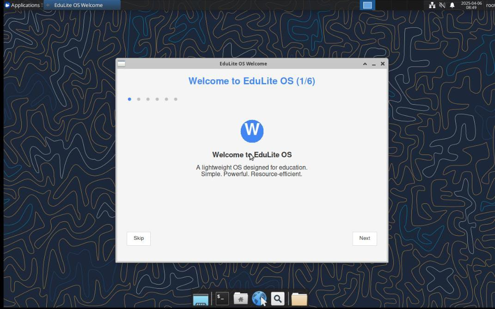
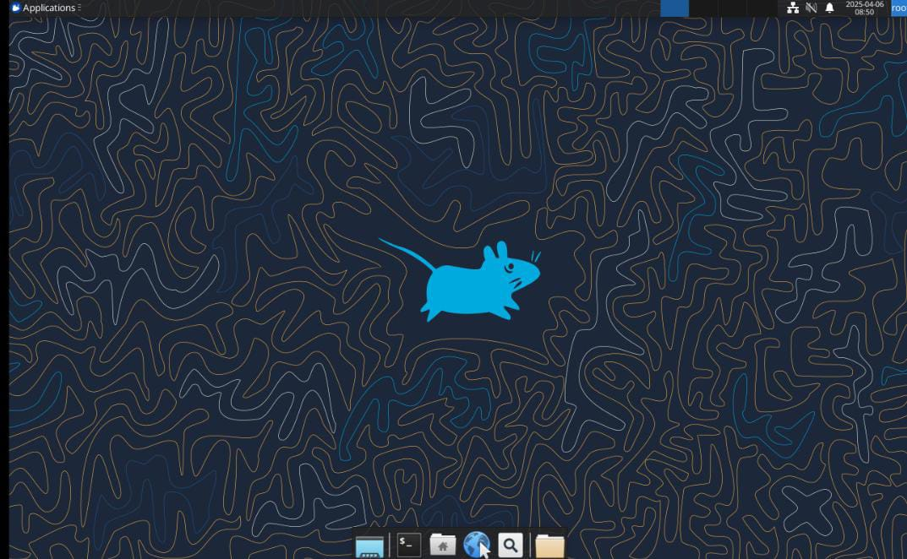
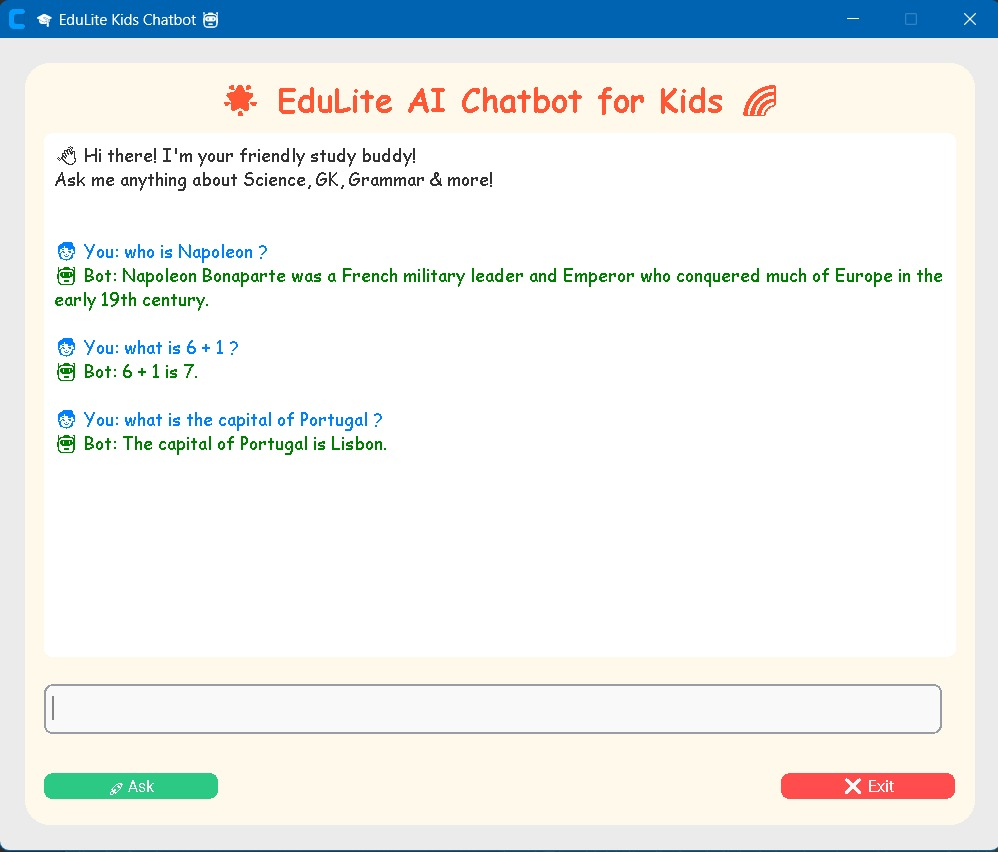
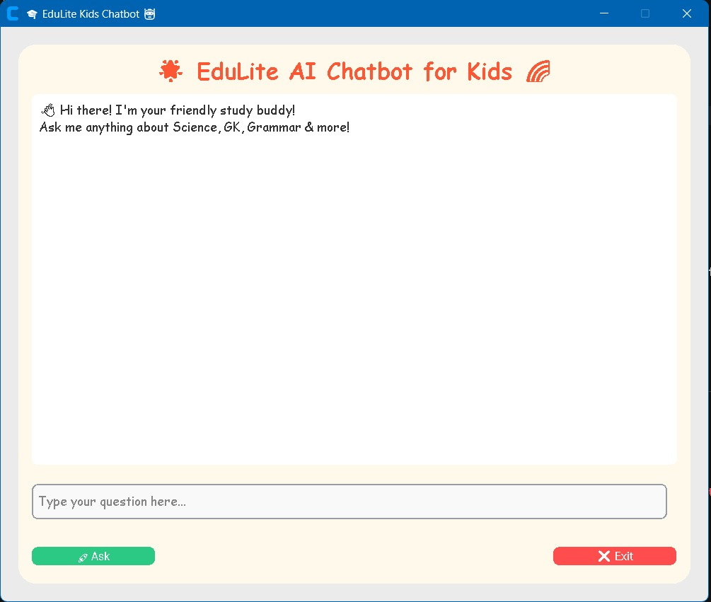
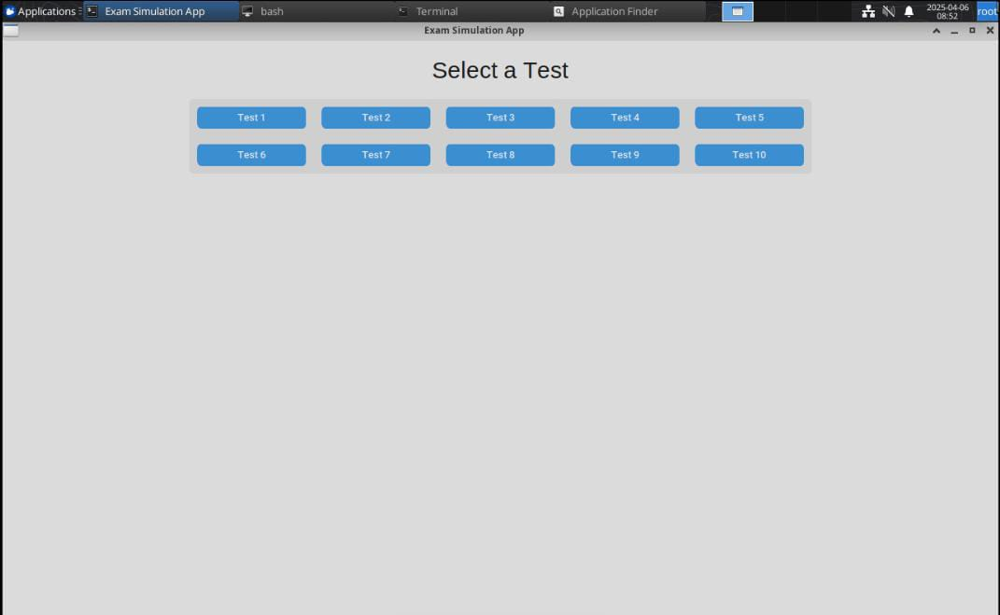
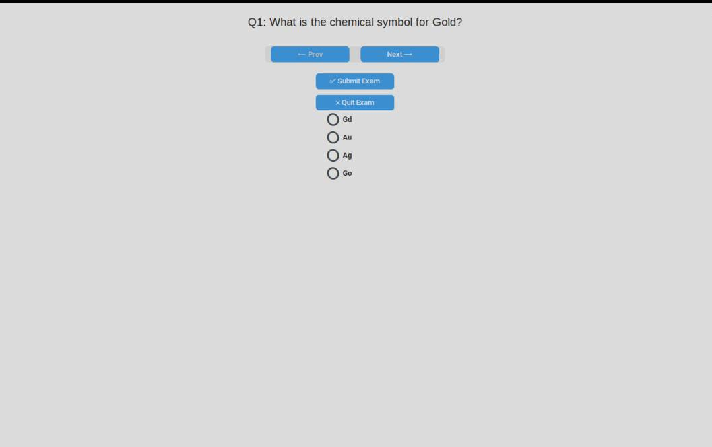
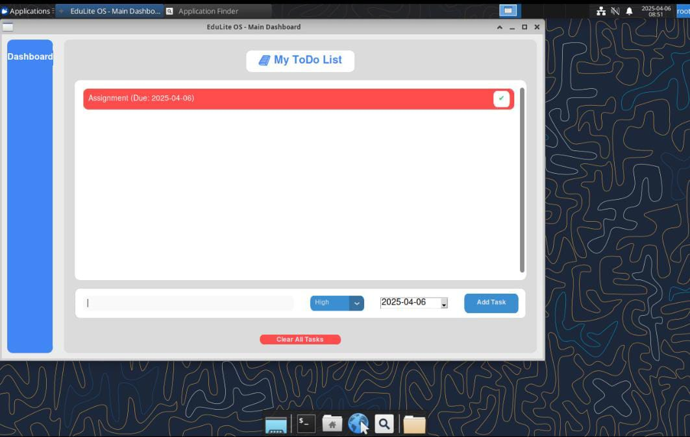

# 🐧 EduLite OS

**EduLite OS** is a lightweight, ubuntu-based Linux operating system tailored for educational use, especially on **low-end hardware (≤2GB RAM)**. It comes pre-installed with essential offline learning tools, teacher dashboards, Kolibri, and Python educational apps — all optimized for speed and simplicity.

---

## ✨ Features

- 🚀 **Runs on Low-End PCs** (≤2GB RAM)
- 🎓 **Offline Learning Tools** including **Kolibri**
- 🐍 **Custom Python Apps** for interactive learning
- 💡 **Simple, Colorful UI** using LXQt
- ⚡ **Optimized with ZRAM** and minimal background services

---

## 🛠️ Tech Stack

| Component           | Details                             |
|--------------------|--------------------------------------|
| Base OS            | Xubuntu                              |
| Desktop Environment| LXQt                                 |
| Package Manager    | `apt`                                |
| Performance Boost  | ZRAM, systemd tweaks                 |
| Offline Tools      | Kolibri, Custom Python educational apps |

---

## 📂 Directory Structure

```bash
/usr/local/share/edu_apps/          # Python apps and dashboards  
/usr/local/bin/myapps/              # Launcher symlinks (added to PATH)  
/usr/share/applications/edu-os/     # Custom .desktop files  
```

---

## 💾 Installation Steps

1. 🔗 **Download ISO from the Official Website**  
   Visit: [[https://edulite-os.github.io](https://edulite-os-showcase.vercel.app/)]([https://edulite-os.github.io](https://edulite-os-showcase.vercel.app/))

2. 💿 **Create Bootable USB**  
   Use tools like **Rufus (Windows)** or **balenaEtcher (Linux/Mac)** to flash the ISO to a USB drive.

3. 💻 **Boot & Install EduLite OS**  
   - Insert the USB stick into the system  
   - Boot from USB via BIOS/UEFI  
   - Follow the simple installation wizard  

4. ✅ You're ready to learn!

---

## 📸 Screenshots

### 🖥️ Welcome Screen


### ✅ Simple Desktop UI


### 📚 Offline Learning with Chatbot *(Future Scope UI Preview)*



### 📝 Exam/Test Mode Interface




### 🗒️ To-Do & Study Tracker


---

## 📈 Roadmap

- [x] Offline Learning Modules  
- [x] Kolibri Integration  
- [x] Teacher Control Panel  
- [x] Low RAM Optimization  
- [x] Exam Mode  
- [ ] Voice Interface *(future scope)*  
- [ ] AI Chatbot *(future scope)*

---

## 🤝 Contributing

We welcome PRs! 

---

## 📜 License

EduLite OS is released under the **GPL-3.0 license**. 

---

## ❤️ Special Thanks

To the open-source Linux, Kolibri, and educational software communities for their support and inspiration.

---
## 🤝 Contributors

Thanks to these amazing people for making EduLite OS possible:


| Name               | GitHub Profile                                     |
|--------------------|----------------------------------------------------|
| Rohit Kshirsagar   | [@rohitkshirsagar19](https://github.com/rohitkshirsagar19) |
| Parth Lhase        | [@LhaseParth2610](https://github.com/LhaseParth2610)       |
| Rishabh Kothari    | [@RishabhK103](https://github.com/RIshabhK103)             |
| Sarthak Dongare    | [@Frosty-8](https://github.com/Frosty-8)                   |

        

